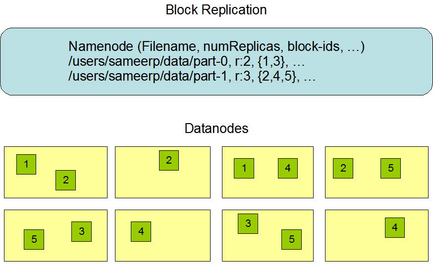

# hadoop-笔记
关于学习hadoop的一些笔记

## hdfs(Hadoop Distributed File System)

### 背景和一些设计思路
1. 硬件错误的自愈方案，在集群中某些硬件错误导致文件无法访问的故障检测和自动恢复
2. 流式数据访问，批处理数据的吞吐量POSIX语义修改
3. 大规模数据集，文件大小一般在GB到TB间，关于文件传输时对于整体带宽传输的优化
4. 简单的一致性模型，关于“一次访问多次读取”类型的文件访问模型时，一个文件经过创建写入关闭之后不需要再改变，简化数据一致性模型，提高访问吞吐量上界
5. “移动计算比移动数据更划算”，在数据达到海量级别时，通过传输计算程序比传输计算数据效率更高，能降低网络阻塞的影响
6. 异构软硬件平台间的可移植性，方便平台的扩容和移植
7. NameNode和DataNode，hdfs采用master/slave架构，1个NameNode对应多个DataNode

hdfs architecture

### 文件系统的名字空间（namespace）
HDFS支持传统的层次型文件组织结构，用户或者应用程序可以创建目录，然后将文件保存至目录中。当前hdfs不支持用户磁盘配额和访问权限控制，也不支持硬链接和软连接。
NameNode复制维护文件系统的namespace，任何文件系统的namespace或属性的修改都会被NameNode记录，应用程序可以设置hdfs保存的文件副本数目

### 数据复制
hdfs可支持跨机器的存储超大文件，将每个文件存储成一系列的数据块，除了最后一块，所有的数据块大小都是相同的。并且每个数据块都会有副本，并且hdfs中的文件都是一次性写入的，并且严格要求任何时候都只能有一个写入者

NameNode全权管理数据块的复制，它周期性的从每个DataNode接收心跳信号和块状态检测

hdfsdatanodes

### 副本存放：最开始的第一步
<<<<<<< HEAD
副本存放是分布式文件系统可靠性和性能的关键，优化副本存放策略是hdfs区分于其他大部分分布式文件系统的重要特性，需要大量的调优和经验的积累。 同时通过机架感知技术（rack-aware）的策略改进数据的可靠性，如将数据块的不同副本存放不同机架上以防止在整个机架失效时数据的丢失

### 副本选择