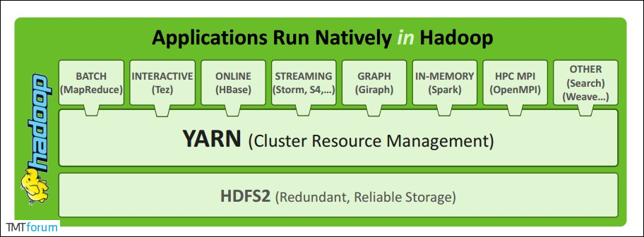
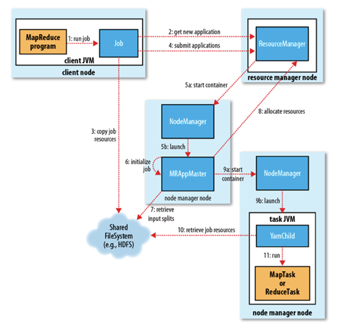

## Apache YARN (Yet Another Resource Negotiator)

Apache YARN (Yet Another Resource Negotiator) 是 hadoop 2.0 引入的集群资源管理系统。用户可以将各种服务框架部署在 YARN 上，由 YARN 进行统一地管理和资源分配。

yarn function

### YARN 架构

YARN Frame

#### ResourceManager
ResourceManager通常在独立的机器上以后台进程的形式运行，它是整个集群资源的主要协调者和管理者。ResourceManager负责给用户提交的所有应用程序分配资源，他根据应用程序优先级、队列容量、ACLs、数据位置等信息作出决策，然后以共享的、安全的、多租户的方式制定分配策略，调度集群资源

#### NodeManager
NodeManager是yarn集群中的每个具体节点的管理者。主要负责该节点内所有容器的生命周期管理，监视资源和跟踪节点健康。具体职能如下：
- 启动时向ResourceManager注册并定时发送心跳消息，等待ResourceManager的指令
- 维护Container的声明周期，监控Container的资源使用情况
- 管理任务运行时的相关依赖，根据ApplicationMaster的需要，在启动Container之前将需要的程序及其依赖拷贝到本地

#### ApplicationMaster
在用户提交一个应用程序的时候，yarn会启动一个轻量级的进程ApplicationMaster，ApplicationMaster负责协调来自ResourceManager的资源。bin通过NodeManager监控容器内部资源的使用情况，同时还负责任务的监控与容错。具体如下：
- 根据应用的运行状态来动态的决定计算资源的需求
- 向ResourceManager申请资源，并且监控所申请资源的使用情况
- 跟踪任务状态和进度，报告资源的使用情况和应用的进度信息
- 负责任务的容错

#### Container
Container是yarn中的资源抽象，它封装了某个节点上的多维度资源，如内存、CPU、磁盘、网络等。当ApplicationManager向ResourceManager申请资源时，ResourceManager为ApplicationManager返回的资源使用Container来表示的。yarn会为每个任务分配一个Container，该任务只能使用该Container中描述的资源。
ApplicationMaster可在Container内运行任何类型的任务。

### YARN工作原理

yarn mode frame

1. client提交作业至yarn
2. ResourceManager选择一个NodeManager，启动container并运行ApplicationMaster实例
3. ApplicationMaster根据实际需求向ResourceManager请求更多container资源（若果作业占用资源很小，ApplicationMaster会选择在自己的JVM中运行任务）
4. ApplicationMaster通过获取到的Container资源执行分布式计算

### YARN工作原理详述

yarn mode frame detail

#### 1. 作业提交
client调用job.waitForCompletion方法，向整个集群提交MapReduce作业。新的作业ID由ResourceManager分配。作业的client核实作业的输出，计算输入的split，将作业的资源（包含jar包，配置文件，split信息）拷贝给hdfs，最后通过调用 ResourceManager的submitApplication来提交作业

#### 2. 作业的初始化
当ResourceManager收到submitApplication的请求时，就将该请求发送给调度器（schedule），调度器分配container，然后ResourceManager在该container内启动ApplicationMaster，由NodeManager管理

#### 3. 任务分配
如果作业很小，ApplicationMaster会选择在自己的JVM中运行，如果不是小作业，那么ApplicationMaster会向ResourceManager请求container来运行所有的map和reduce任务。这些请求是通过心跳机制传播的包括每个map任务的数据位置，存放split的主机名和机架等

#### 4. 任务运行
当一个任务由ResourceManager的调度器分配一个container后，ApplicationManager通过联系NodeManager来启动container。任务由一个主类为YarnChild的Java应用程序执行

#### 5. 进度和状态更新
yarn中的任务将其进度和状态返回给ApplicationManager

#### 6. 作业完成
除了通过向ApplicationManager请求作业进度外，客户端每五分钟都会通过调用waitForCompletion来检测作业是否完成。
